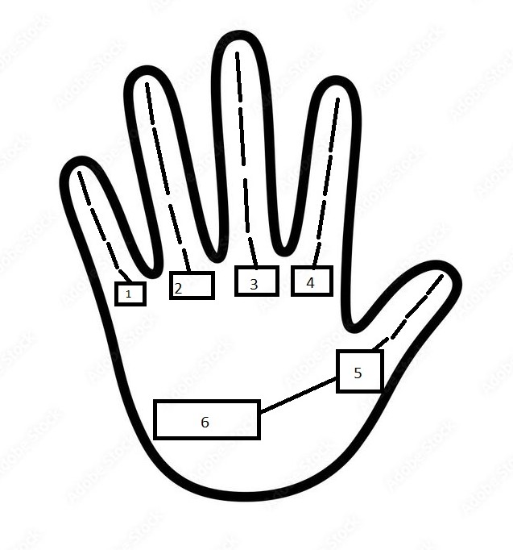
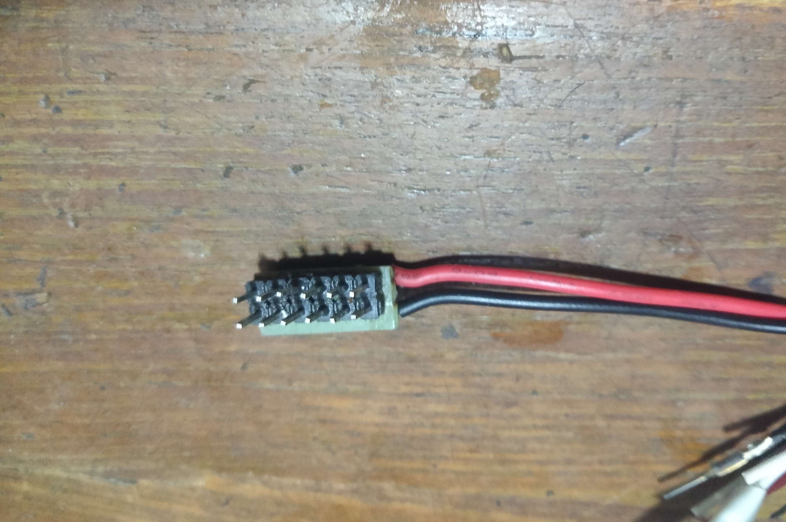

# Bionic Hand

This project features a custom-built bionic hand made using an **Arduino Uno R3**, **six servos**, and a combination of custom parts

<p float="left">
  
  
</p>

---

## ⚙️ Design Overview

> **Disclaimer:**  
> This is an experimental design. I don’t recommend replicating it exactly, but if you're curious or want to try it—go for it.

- Strings attached to the servos act as **flexor tendons**.
- Rubber bands at the back serve as **extensor tendons**.
- Servos **1–5** control individual fingers.
- Servo **6** controls the **thenar eminence** (thumb base movement).

---

## 🔌 Wiring

Servos require PWM signals, so connect them to the **PWM-capable pins** on the Arduino Uno:


| Arduino Pin | Servo # | Function         |
|-------------|---------|------------------|
| 11          | 6       | Thenar Eminence  |
| 10          | 1       | Pinky Finger     |
| 9           | 2       | Ring Finger      |
| 6           | 3       | Middle Finger    |
| 5           | 4       | Index Finger     |
| 3           | 5       | Thumb            |




### Recommended Setup:
Use a **perf board** to create two horizontal rows of header pins for clean wiring. Like this:




If you prefer, a **breadboard** or a manually **soldered wire bundle** it works.

---

## 🧠 Commands

To control the hand:

1. Open the **Serial Monitor**.
2. Set the **baud rate to 9600**.
3. Send one of the following single-character commands:

| Command | Action                |
|---------|------------------------|
| `a`     | Thumbs up              |
| `b`     | Open hand              |
| `c`     | Make a fist            |
| `d`     | Show middle finger     |
| `e`     | Close thumb (servo 5)  |
| `f`     | Close index (servo 4)  |
| `g`     | Close middle (servo 3) |
| `h`     | Close ring (servo 2)   |
| `i`     | Close pinky (servo 1)  |
| `j`     | Spiderman gesture      |
| `rts`   | Rock-Paper-Scissors    |

### `rts` Logic:

The `rts` command is a randomizer function which randomly selects "b", "c", "j":
- `b` = Paper  
- `c` = Rock  
- `j` = Scissors  

---

## 🔧 Calibration

if you somehow magically got the design close to mine then the commands will work out of the box but if you are not so lucky it will not to  work, tweak the angular values of this array:

```cpp
const int positions[][6] = {
  {0, 360, 360, 360, 500, 0},     // a - Thumbs up
  {0, 0, 0, 0, 0, 0},             // b - Open hand
  {360, 360, 360, 360, 500, 105}, // c - Fist
  {360, 360, 0, 360, 500, 100},   // d - Middle finger
  {360, 0, 0, 0, 0, 0},           // e - Close thumb
  {0, 500, 0, 0, 0, 0},           // f - Close index
  {0, 0, 500, 0, 0, 0},           // g - Close middle
  {0, 0, 0, 360, 0, 0},           // h - Close ring
  {0, 0, 0, 0, 500, 0},           // i - Close pinky
  {0, 0, 500, 360, 0, 0},         // j - Spiderman
  {360, 0, 0, 360, 500, 105},     // k - Scissors (for rts)
};
```


credits to [BOB](https://github.com/BOB-The-Battle-Engineer) for the arm desin
